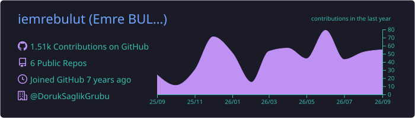
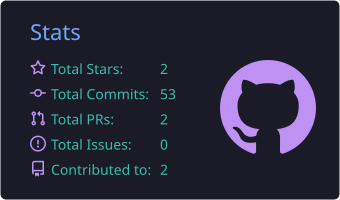
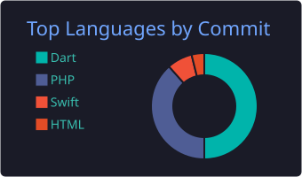

<h1 align="center">Hi there, I'm Emre 👋</h1>

  

  

---

### 🙋‍♂️ About Me

- 👯 I'm looking to collaborate on **mobile apps**, **web development** projects and other exciting software ideas.
- 👨‍💻 I build projects with **Flutter, PHP, Node.js, Vue.js, React and .NET** together with my team.
- 🌍 I love working **remotely** and also work as a **freelancer**.
- ⚡ Fun fact: I enjoy camping, cycling and reading books.
- 📫 How to reach me: **[iemrebulut@gmail.com](mailto:iemrebulut@gmail.com)**

---

### 🛠️ Languages & Tools

  

---

### 📊 GitHub Stats

  

  
  

  

---

### 🤝 Connect With Me

  
  
  
  

<i>Thanks for stopping by! ⭐</i>

